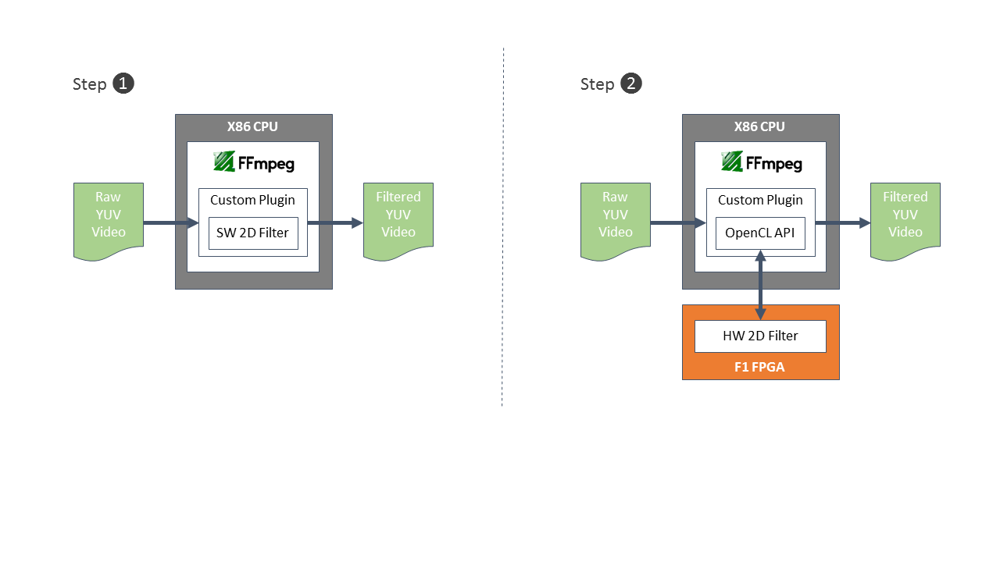

<table style="width:100%">
  <tr>
    <th width="100%" colspan="6"><h2>AWS F1 Xilinx Developer Labs</h2></th>
  </tr>
  <tr>
    <td width="17%" align="center"><a href="README.md">Introduction</a></td>
    <td width="16%" align="center"><a href="SETUP.md">1. Connecting to your F1 instance</a></td> 
    <td width="17%" align="center"><b>2. Experiencing F1 acceleration</b></td>
    <td width="17%" align="center"><a href="FILTER2D_Lab.md">3. Developing F1 applications</a></td>
    <td width="16%" align="center"><a href="AVFILTER_Lab.md">4. Creating a custom FFmpeg plugin</td>
    <td width="17%" align="center"><a href="WRAP_UP.md">5. Wrapping-up</td>
  </tr>
</table>

---------------------------------------

### Experiencing F1 Acceleration

In this module you will experience the acceleration potential of AWS F1 instances by using ffmpeg to filter raw YUV 1920x1080 video, first using the filter executing on the CPU, and then executing the hardware accelerated filter optimized for F1 FPGAs. 



```ffmpeg``` is a very popular framework providing very fast video and audio converters. The ```ffmpeg``` code is open-source and allows for the addition of custom plugins. For this lab, a custom AVFilter plugin has been created to transparently use the hardware accelerated two-dimensional filter running on AWS F1.

Users can switch between the filter running on CPU and the F1-accelerated implementation by simply changing a parameter on the ```ffmpeg``` command line. The plugin uses OpenCL API calls to write video frames to the FPGA, execute the filter on the FPGA, and read back the filtered video. A number of preset filters (identity, blur, motionblur, sharpen) can be accesses via the ffmpeg command line.

#### Setting-up the lab

1. Open a new terminal by right-clicking anywhere in the Desktop area and selecting **Open Terminal**. 
1. Navigate to the FFmpeg lab directory.
    ```bash
    cd ~/AWS-F1-Developer-Labs/ffmpeg
    ```

1. Source the SDAccel runtime environment.
    ```bash
    sudo sh
    source /opt/Xilinx/SDx/2017.1.rte/setup.sh
    ```

#### Step 1: Running with the filter on the CPU 

1. Load the FFmpeg settings. 
    ```bash
    source ./ffsetup.sh
    ```

1. Run with the video filter running on the CPU.
    ```bash
    ./ffmpeg -f rawvideo -pix_fmt yuv420p -s:v 1920x1080 -i /home/centos/vectors/crowd8_420_1920x1080_50.yuv -an -frames 1000 -c:v libx265 -preset medium -g 30 -q 40 -f hevc -y ./crowd8_420_1920x1080_50_libx265_out0_qp40.hevc
    ```

    ```ffmpeg``` will finish with a message similar to this one: \
    *frame=500 **fps=9.0** q=-0.0 **Lsize=19933kB** time=00:00:19.92 bitrate=8197.4kbits/s **speed=0.358x*** 
    > **fps** measures the performance of the encoder in processed frames per second.
 
#### Step 2: Running with the filter on the F1 FPGA 
  
1. Load the HEVC encoder FPGA binary in the F1 instance. 
    ```bash
    fpga-load-local-image -S 0 -I agfi-0015437e933b3e725
    ```

1. Run with the filter running on the F1 FPGA, using just one filter kernel.
    ```bash
    ./ffmpeg -f rawvideo -pix_fmt yuv420p -s:v 1920x1080 -i /home/centos/vectors/crowd8_420_1920x1080_50.yuv -an -frames 1000 -c:v xlnx_hevc_enc -psnr -g 30 -global_quality 40 -f hevc -y ./crowd8_420_1920x1080_50_NGcodec_out0_g30_gq40.hevc 
    ```

    ```ffmpeg``` will finish with a message similar to this one: \
    *frame=500 **fps=52** q=-0.0 LPSNR=Y:inf U:inf V:inf \*:inf **size=17580kB** time=00:00:20.00 bitrate=7200.9kbits/s **speed=2.08x***

1. Run with the filter running on the F1 FPGA, now using just three filter kernels.
    ```bash
    ./ffmpeg -f rawvideo -pix_fmt yuv420p -s:v 1920x1080 -i /home/centos/vectors/crowd8_420_1920x1080_50.yuv -an -frames 1000 -c:v xlnx_hevc_enc -psnr -g 30 -global_quality 40 -f hevc -y ./crowd8_420_1920x1080_50_NGcodec_out0_g30_gq40.hevc 
    ```

    ```ffmpeg``` will finish with a message similar to this one: \
    *frame=500 **fps=52** q=-0.0 LPSNR=Y:inf U:inf V:inf \*:inf **size=17580kB** time=00:00:20.00 bitrate=7200.9kbits/s **speed=2.08x***

#### Step 3: Comparing performance 

1. The table below summarizes the performance of both encoders:

    |                           | Filter on CPU | Filter on F1 (1 kernel) | Filter on F1 (3 kernels) |
    | :------------------------ |-------------:| -------:| -------:|
    | performance               | 9 fps        | 52 fps  | 52 fps  |
    | duration                  | 55.6 sec     | 9.6 sec | 9.6 sec |

1. Close your terminal to conclude this module.
    ```bash
    exit
    exit
    ```

#### Conclusion

AWS F1 instances with Xilinx FPGAs can provide significant performance improvements over CPUs. The 2D video filter running on F1 is **5.7x** faster than the filter running on the CPU.

Multiple instances of the video filter could be loaded in the FPGA, allowing parallel processing of multiple video streams and easily delivering more than a 10x increase in performance/$ over a CPU-based solution. 

It is possible to use F1 to accelerate popular frameworks such as ```ffmpeg```. This is a very powerful proposition as it allows end-users to keep working with their preferred tools and APIs while transparently benefiting from acceleration.

In addition to video filtering, F1 instances are very well suited to accelerate compute intensive workloads such as: video transcoding, genomics, financial analytics, big data analytics, security or machine learning.

Now that you have experienced the performance potential of AWS F1 instances, the next lab will introduce you to the SDAccel IDE and how to develop, profile and optimize an F1 application.

---------------------------------------

<p align="center"><b>
Start the next module: <a href="FILTER2D_Lab.md">3. Developing, profiling and optimizing F1 applications with SDAccel</a>
</b></p>

