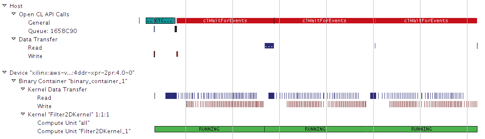
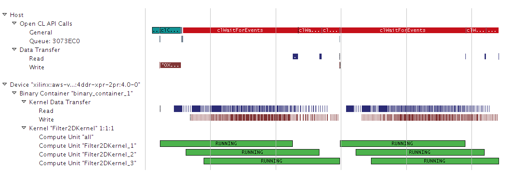

<table style="width:100%">
  <tr>
    <th width="100%" colspan="6"><h2>AWS F1 Xilinx Developer Labs</h2></th>
  </tr>
  <tr>
    <td width="17%" align="center"><a href="README.md">Introduction</a></td>
    <td width="16%" align="center"><a href="SETUP.md">1. Connecting to your F1 instance</a></td> 
    <td width="17%" align="center"><a href="FFMPEG_Lab.md">2. Experiencing F1 acceleration</a></td>
    <td width="17%" align="center"><b>3. Developing F1 applications</b></td>
    <td width="16%" align="center"><a href="AVFILTER_Lab.md">4. Creating a custom FFmpeg plugin</td>
    <td width="17%" align="center"><a href="WRAP_UP.md">5. Wrapping-up</td>
  </tr>
</table>
	
---------------------------------------
	
### Developing, profiling and optimizing F1 applications with SDAccel

This tutorial is designed to teach the fundamentals of the SDAccel development environment and programming model. This includes: familiarizing with OpenCL, understanding software and hardware emulation flows, profiling performance and identifying how to optimize host and kernel code. 

The kernel used in this tutorial is a 2D video filter, a function widely used in video processing algorithms such as noise reduction, and image sharpening. 

To simplify this tutorial, a workspace preloaded with the initial project configuration is provided in the lab repository.

Please also note that although the entire tutorial is performed on an F1 instance, only the final step of this tutorial really needs to be run on F1. All the interactive development, profiling and optimization steps would normally be performed on-premise or on a cost-effective AWS EC2 instance such as C4. However, to avoid switching from C4 to F1 instances during this tutorial, all the steps are performed on the F1 instance.

### Starting SDAccel

1.  Open a new terminal by right-clicking anywhere in the Desktop area and selecting **Open Terminal**. 

1.  Source the SDAccel environment  

    ```bash
    cd ~/aws-fpga
    source sdaccel_setup.sh
    source $XILINX_SDX/settings64.sh 
    cd ~
    ```
	*Note: the sdaccel_setup.sh script might generate warning messages, but these can be safely ignored.*


1. Launch the SDAccel GUI and open the predefined workspace containing the Filter2D project: 
    ```bash
    cd ~/SME-Developer-Labs/module_02/filter2d
    sdx -workspace workspace
    ```
	*Note: a warning message may appear if loading Eclipse takes longer than expected. Click **Wait** to dismiss it.*

	The predefined workspace takes care of the following setup steps:
	* Creating a new project called **Filter2D**
	* Adding the AWS-VU9P-F1 platform to the project and selecting it as the target for this project 
	* Importing the host and kernel source files
	* Setting GCC compile and link options
	* Setting the name of the FPGA binary container as **binary_container_1**
	* Setting the **Filter2DKernel** function to be a custom hardware function (also referred to as kernel).
	* Setting command line arguments to be passed to the application when it is executed.	

	Most of this information is displayed in the **SDX Project Settings** window which is prominently displayed in the center of the GUI. It indicates the project name (**Filter2D**), the selected platform (**AWS-VU9-F1**) and the FPGA binary container (**binary_container_1**) with the hardware function (**Filter2DKernel**).  
 
 _TODO: Update screenshot_
    

1. Familiarize yourself with the different sections of the GUI layout:
    * The **main menu** bar is located on the top. This menu bar allows direct access to all general project setup and GUI window management tasks. As most tasks are performed through the different setup windows, the main menu is mostly used to recover from accidently closed windows or to access the tool help.
    * Directly below the main menu bar is the **SDAccel toolbar**.  This provides access to the most common tasks in a project. From left to right, these are: File Management functions (new, save, save all), Configuration Management, Build, Build All, Start Debug, and Run. Most buttons have a default behavior as well as pulldowns.
    * The **Project Explorer** window occupies the top left hand side of the GUI. This window is used to manage and navigate through project files. In the expanded **src** folder you should be able to see the source files of the project. 
    * In the middle is the **SDx Project Settings** window. This window is intended for project management and presents the key aspects of an SDx Project. 
    * The **Outline** viewer on the right hand side is used for file navigation. The content of the outline varies depending on the file currently selected in the main window.
    * In the bottom left section is the **Reports window**. This allows easy access to all reports generated by SDAccel. 
    * The remaining windows along the bottom of the main window accommodate the various consoles and terminals which contain output information relating to individual SDAccel executables. Typical output examples are compilation errors or the tool output when running.  

### Overview of the source code used in this example

1. Expand the **src** directory in the **Project Explorer**. 
The project is comprised of two directories:
	* **host** contains the code for the host application running on the CPU.
	* **kernel** contains the code for the kernel (custom accelerator) running on the FPGA.

1. Expand the **host** directory in the **Project Explorer**. 
The host code is comprised of the following files:
	* **host.cpp** contains the main application code.
	* **filter2d.cpp** contains the code for the filter function running on the CPU.
	* **xclbin_helper.cpp and .h** contains helper code for downloading accelerators to the FPGA.
	* **cmdlineparser.cpp and .h** contains the code for parsing command line arguments.
	* **logger.cpp and .h** contains code for logging information.

1. Expand the **kernel** directory in the **Project Explorer**. 
The kernel code is comprised of the following files:
	* **filter2d.cpp** contains the code for the filter function running on the FPGA.
	* **axi2stream.cpp and .h** contains the code for efficiently reading from and writing to memory.
	* **window_2d.h and hls_video_mem.h** contains the code for handling video line buffers and pixel windows.

1. Now open the **filter2d.cpp** file under **src/kernel**.

1. Locate the **Outline** viewer located on the right side of the GUI. 
	* This view provides a convenient way of looking-up and navigating the code hierarchy. 
	* Each green dot in the **Outline** viewer corresponds to a function in the selected source file. 

_TODO: Update screenshot_

    

1. In the **Outline** viewer, click **Filter2DKernel** to look-up this function. 
	* The **Filter2DKernel** function is the top-level of the filter kernel implemented in the custom hardware accelerator. Interface properties for the accelerator are specified in this function. 
	* This computationally heavy function can be highly parallelized on the FPGA, providing significant acceleration over a CPU-based implementation.
	* The kernel encapsulates the three main functions of the accelerator: **AXIBursts2PixelStream**, **Filter2D**, and **PixelStream2AXIBursts**.
	* The **AXIBursts2PixelStream** function reads from global memory values sent by the host application and streams them to the **Filter2D** function.
	* The **Filter2D** function receives the pixel data and performs the actual filter computations, and streams the results back out.
	* The **PixelStream2AXIBursts** function receives the streaming results from the **Filter2D** function and writes them back to global memory for the host application.
	* Observe that the three functions are communicating using `hls::streams` objects. These objects model a FIFO-based communication scheme. This is the recommended coding style which should be used whenever possible to exhibit streaming behavior and allow DATAFLOW optimization.
		- The DATAFLOW optimization allows each of the subsequent functions to execute as independent processes. 
		- This results in overlapping and pipelined execution of the read, execute and write functions instead of sequential execution.
		- The FIFO channels between the different processes do not need to buffer the complete dataset anymore but can directly stream the data to the next block. 
	* Note that the **Filter2D** kernel processes only a single plane. At compile time, we can choose to have 1 or many kernels in the FPGA. 
		- In case there is only 1 kernel in the FPGA, a planar formatted YUV 4:4:4 image will have its luma and chroma planes procesed sequentially. 
		- In case there are 3 kernels in the FPGA, the luma and both chroma planes can be processed in parallel, therefore having a higher performance, at the cost of more FPGA resources. We will get back to this later in the lab.

1. Using the **Outline** viewer, quickly look-up and inspect the other important function of the accelerator:
	* The **Filter2D** function is the heart of the custom hardware accelerator that peforms the filter computations.
	* It uses the **Window2D** class that provides an abstraction for getting a two-dimensial pixel window, then performs a simple convolution of the pixels in this window with a programmable filter.
	* Note that one iteration of the **for x** loop will execute in one clock cycle. The resulting hardware will therefore use 15*15=225 multipliers.
	
1. Now open the **host.cpp** file (from the **src/host** folder of the **Project Explorer** view).  

1. Again, use the **Outline** viewer to quickly look-up and inspect the two main functions of the host application:
	* The **main** function of the C++ program initializes the test vectors, sets-up OpenCL, runs the reference model, runs the hardware accelerator, releases the OpenCL resources, and compares the results of the reference Filter2D model with the accelerator implementation.
	* The **Filter2DDispatcher** class takes care of calling the hardware accelerated Filter2DKernel. This class uses the OpenCL API calls to communicate with the FPGA and this is covered in greater detail later in this tutorial.

1. Go to line 201 of the **host.cpp** file by pressing **Ctrl+L** and entering **201**. 

	Locate the call to the **load_xclbin_file** function. This function is where the OpenCL environment is setup in the host application. This section is typical of most SDAccel application and will look very familiar to developers with prior OpenCL experience. This body of code can often be reused as-is from project to project. 

	To setup the OpenCL environment, the following API calls are made:

	* **clGetPlatformIDs**: This function queries the system to identify the different OpenCL platforms. It is called twice as it first extracts the number of platforms before extracting the actual supported platforms.
	* **clGetPlatformInfo**: Get specific information about the OpenCL platform, such as vendor name and platform name.
	* **clGetDeviceIDs**: Obtain list of devices available on a platform.
	* **clCreateContext**: Creates an OpenCL context, which manages the runtime objects.
	* **clGetDeviceInfo**: Get information about an OpenCL device like the device name.
	* **clCreateProgramWithBinary**: Creates a program object for a context, and loads specified binary data into the program object. The actual program is obtained before this call through the load_file_to memory function.

	Note: all objects accessed through a **clCreate...** function call are to be released before terminating the program by calling **clRelease...**. This avoids memory leakage and clears the locks on the device.

1. Now go back to the **host.cpp** file, and take a look at the **Filter2DDispatcher** class. 

	The **Filter2DDispatcher** class takes care of calling the hardware accelerated Filter2DKernel. This class uses the following OpenCL API calls to communicate with the FPGA: 
	* **clCreateKernel**: Creates a kernel object.
	* **clCreateCommandQueue**: Create a command-queue on a specific device.
	* **clCreateBuffer**: Creates a memory buffer.
	* **clEnqueueMigrateMemObjects**: Migrates a set of memory objects to the OpenCL device associated or to the host.
	* **clSetKernelArg**: Sets a kernel argument.
	* **clEnqueueTask**: Enqueues a command to execute a kernel on a device.
	* **clSetEventCallback**: Registers a user callback function for a specific command execution status.

	All of the above API functions are documented by the [Khronos Group](https://www.khronos.org), the maintainers of OpenCL, the open standard for parallel programming of heterogeneous systems

### Running the Emulation Flows

SDAccel provides two emulation flows which allow testing the application before deploying on the F1 instance. The flows are referred to as software emulation (or Emulation-CPU) and hardware emulation (or Emulation-HW), respectively.
* Software emulation is used to identify syntax issues and verify the functional behavior of the application.
	* In software emulation, both the host code and the kernel code are compiled to run on the x86 processor. 
	* This allows iterative algorithm refinement through fast build and run loops.
* Hardware emulation is used to get performance estimates for the accelerated application.
	* In hardware emulation, the host code is compiled to run on the x86 processor and the kernel code is compiled into a hardware model (known as RTL or Register Transfer Level) which is run in a special simulator.
	* The build and run cycle takes longer because the kernel code is compiled into a detailed hardware model which is slower to simulate.
	* The more detailed hardware simulation allows more accurate reporting of kernel and system performance.
	* This flow is also useful for testing the functionality of the logic that will go in the FPGA.

In this lab, we will only run the hardware emulation flow.

SDAccel uses Makefiles to perform incremental compilation of the project. This means that unless file changes require the recompilation of the host code or of the kernel code, no compilation is performed.

1. Return to the **SDx Project Settings** by clicking on **project.sdx** in the **Project Explorer** window (left side of the GUI).

1. In the upper right corner of the **SDx Project Settings** window, the **Active build configuration** is shown. Ensure that **Emulation-HW** is selected.

1. Click the **Run** button  to run hardware emulation.
	* The **Console** provides the detailed build log during the compilation of the kernel and the host code. It then displays the standard output produced by the application during the actual emulation run.  
	* The hardware emulation is complete when the following messages are displayed at the bottom of the **Console**:

 _TODO: Update messages below_
	

	```
	Running FPGA version
	   kernel finished processing request 0
	   kernel finished processing request 1
	   kernel finished processing request 2
	Running Software version

	*******************************************************
	MATCH PASS: Output matches reference
	*******************************************************
	```

### Analyzing the Reports  

This section covers how to locate and read the various reports generated by the emulation runs. 

1. Locate the **Reports** window in the bottom-left corner of the GUI. 
	* This window displays a tree layout of folders and reports for all runs and open projects. 
	* The top level shows the **Filter2D** project for which we have executed the **Emulation-HW** run.

 _TODO: Update screenshot_

    

1. Look into the **Emulation-HW** folder.
	* The **Filter2D-Default** run configuration folder contains the **Profile Summary** and **Application Timeline** report generated during the hardware emulation run.

	* The **binary_container_1** folder contains the **HLS Report** from the compilation of the C++ kernel into the detailed hardware model (RTL). This compilation step is often referred to as High Level Synthesis or HLS.

1. Open the **Profile Summary** report from the **Emulation-HW** run. 
  
    * This report provides data related to how the application runs. Notice that the report has four tabs at the top: **Top Operations**, **Kernels & Compute Units**, **Data Transfers**, and **OpenCL APIs**. 
    
1. Click through and inspect each of the tabs:

    * **Top Operations**: Shows all the major top operations of memory transfer between the host and kernel to global memory, and kernel execution. This allows you to identify throughput bottlenecks when transferring data. Efficient transfer of data to the kernel/host allows for faster execution times.
    
    * **Kernels & Compute Units**: Shows the number of times the kernel was executed. Includes the total, minimum, average, and maximum run times. If the design has multiple compute units, it will show each compute unit’s utilization. When accelerating an algorithm, the faster the kernel executes, the higher the throughput which can be achieved. It is best to optimize the kernel to be as fast as it can be with the data it requires.
    
    * **Data Transfers**: This tab has no bearing in software emulation as no actual data transfers are emulated across the host to the platform. In hardware emulation, this shows the throughput and bandwidth of the read/writes to the global memory that the host and kernel share.
    
    * **OpenCL APIs**: Shows all the OpenCL API command executions, how many time each was executed, and how long they take to execute.

1. Locate the **Profile Rule Checks** section at the bottom of the **Profile Summary** 
    - **Profile Rule Checks** (PRCs) interpret profiling results and suggest areas for performance improvements.
    - PRCs compare profiling results to threshold values. If a check does not meet the threshold value, the right hand column provides guidance on how to improve performance.
    - PRCs work for both hardware emulation and system runs on the FPGA.

     


1. Open the **Application Timeline** report from the **Emulation-HW** run. 
	- The **Application Timeline** collects and displays host and device events on a common timeline to help you understand and visualize the overall health and performance of your systems. 
	- These events include OpenCL API calls from the host code: when they happen and how long each of them takes.
    
	- Observe at the bottom of the timeline view that we have one instance of **Filter2DKernel**
	- The green segments indicate that the kernel is executed consecutively 3 times and is continuously running
	- The blue and brown segments located immediately above represent when the kernel is reading input and writing results to and from global memory
	- We can see that the longer blue segments align with the start of each of the 3 invocations of the kernel

1. Close the **Application Timeline** and **Profile Summary** report.

### Optimization   

The previous section gave an overview of the SDAccel performance analysis reports. The next step is to use these analysis capabilities to drive and measure code optimizations. This tutorial illustrates how an application can be accelerated by executing multiple kernels in parallel and by optimaly controling accelerator synchronization in the host application.


### Adding More Kernels  

_Give explanations about processing Y,U,V in parallel. Refer to host code, host.cpp lines 263-265_. 

1. Return to the **SDx Project Settings** and locate the **Hardware Functions** section in the bottom half of the window

1. Increase the number of **Compute Units** for the **Filter2DKernel** from 1 to 3

1. Make sure **Emulation-HW** is still selected as the **Active build configuration** and run HW emulation by clicking the **Run** button  or by pressing **Ctrl+F11**
	- Rebuilding the design with 3 kernels takes about 5-6 minutes

1. After HW emulation completes, open the newly generated **Application Timeline**. 

    	

	- Observe that we now have 3 kernels instances executing in parallel
	- Instead of processing Y, U and V planes sequentially, they are not executed in parallel
	- By using more kernel instances we take advantage of task-level parallelism to improve the performance of the application


1. Close the **Application Timeline**.


### Processing More Images

In the previous run, the application processed a single image. In a real life scenario, the application would most likely need to process multiple images or video frames. It is therefore important to profile the performance of the application when processing multiple images. 

The source code already provides a command line argument to specify the number of times the input image should be processed. We will use this feature easily generate a new timeline trace, this time making two processing passes on the input image.

1. From the **main menu** bar of the SDx GUI, choose the **Run** menu and open the **Run Configurations** window.

1. In the **Run Configurations** window, choose the **Arguments** tab.
	- This tab allows specifying the command line arguments passed to the application when it is executed
		- ```-x``` is used to specify the name of FPGA image
		- ```-i``` is used to specify the name of bitmap image to be processed
		- ```-n``` is used to specify how many times the image should be processed

1. Change ```-n 1``` to ```-n 2```. 
	- This will cause the application to process the image twice instead of just once

    	

1. Rerun HW emulation by clicking the **Run** button or by pressing **Ctrl+F11**.
	- This time, the application doesn't need to be recompiled since only command line arguments were changed
	- The HW emulation run should complete in under a minute
	- Notice that in the console, 6 requests are now reported instead of the 3 we saw before

1. Open the newly generated **Application Timeline**. 

    

    - Observe that there are now 6 total invocations of **Filter2DKernel**, as expected
    - Since there 3 instances of the kernel, each kernel instance is put to work twice
    - Observe also that there is a gap between two executions of a given kernel instance
    - Effectively, the second execution of Filter2DKernel_1 only starts after the first execution of the Filter2DKernel_3
	- The gap between the two segments is indicative of idle time between these two invocations 
    - This behavior is caused by how the host application synchronizes between various kernel invocations

### Host Code Optimization

1. Open **host.cpp** file (from the **Project Explorer** window).  

1. Go to line 267 of the **host.cpp** file by pressing **Ctrl+L** and entering **267**. 
	_Explain the synchronization mechanism_

	```C
	for(int xx=0; xx<numRuns; xx++) 
	{
		// Make independent requests to Blur Y, U and V planes
		// Requests will run sequentially if there is a single kernel
		// Requests will run in parallel is there are two or more kernels
		request[xx*3+0] = Filter(coeff.data(), y_src.data(), width, height, stride, y_dst.data());
		request[xx*3+1] = Filter(coeff.data(), u_src.data(), width, height, stride, u_dst.data());
		request[xx*3+2] = Filter(coeff.data(), v_src.data(), width, height, stride, v_dst.data());

		// Wait for completion of the outstanding requests
		request[xx*3+0]->sync();
		request[xx*3+1]->sync();
		request[xx*3+2]->sync();
	}
	```

1. Modify the source code as shown below
	```C
	for(int xx=0; xx<numRuns; xx++) 
	{
		// Make independent requests to Blur Y, U and V planes
		// Requests will run sequentially if there is a single kernel
		// Requests will run in parallel is there are two or more kernels
		request[xx*3+0] = Filter(coeff.data(), y_src.data(), width, height, stride, y_dst.data());
		request[xx*3+1] = Filter(coeff.data(), u_src.data(), width, height, stride, u_dst.data());
		request[xx*3+2] = Filter(coeff.data(), v_src.data(), width, height, stride, v_dst.data());
	}
	for(int xx=0; xx<numRuns; xx++) 
	{
		// Wait for completion of the outstanding requests
		request[xx*3+0]->sync();
		request[xx*3+1]->sync();
		request[xx*3+2]->sync();
	}
	```

	- With this change _explain..._

1. Save the file (**Ctrl-S**) and rerun hardware emulation by clicking the **Run** button . 

    - Since only the **host.cpp** file was changed, the incremental makefile rebuilds only the host code before running emulation.
    
	
1. Open the **Application Timeline** of the **Emulation-HW** run.  

    

    - _Give some explanations_
    
1. Close the **Application Timeline**.    
	

### Building the FPGA binary to execute on F1 

Once the application and kernel code have been optimized, the next step is to create an FPGA binary for execution on the F1 instance. 

Creating the FPGA binary is a two-step process:
* First SDAccel is used to build the Xilinx FPGA binary (.xclbin file).
* Then the AWS **create_sdaccel_afi.sh** script is used to create the AWS FPGA binary (.awsxclbin file) and register a secured and encrypted Amazon FPGA Image (AFI).

The **create_sdaccel_afi.sh** script does the following:
* Starts a background process to create the AFI
* Generates a \<timestamp\>_afi_id.txt which contains the FPGA Image Identifier (or AFI ID) and Global FPGA Image Identifier (or AGFI ID) of the generated AFI
* Creates the *.awsxclbin AWS FPGA binary file which is read by the host application to determine which AFI should be loaded in the FPGA.

These steps would take too long to complete during this tutorial, therefore a precompiled FPGA binary is used to continue this lab and execute on F1.

### Executing on F1 

1. Close the SDAccel GUI and report to the terminal from which you started the tool.

1. Confirm that FPGA binary (.awsxclbin file) is indeed present.

	```bash
	# Go the lab folder
	cd /home/centos/SME-Developer-Labs/module_02/filter2d
	
	# List contents of the ./xclbin directory to look for the .awsxclbin FPGA binary
	ls -la ./xclbin
	```
	
_TODO: This section needs updating with name of awsxclbin files and AFI ids_

1. Retrieve the FPGA Image Global Id (agfi) from the \<timestamp\>_afi_id.txt file.
	
	```bash
	more ./xclbin/18_04_12-035517_afi_id.txt
	```	

1. Confirm that the FPGA Image is ready and available using the retrieved Id.

	``` bash
	aws ec2 describe-fpga-images --filters Name=fpga-image-global-id,Values=agfi-0710dc06e6e142782
	```
   
   The output of this command should contain:

    ``` json
    ...
    "State": {
        "Code": "available"
    },
    ...
    ```	
	
1. Copy the host application executable built in the SDAccel workspace to the local directory and execute the accelerated application on F1 using the FPGA binary.

    ``` shell
    # Copy the host application executable
    cp /home/centos/SME-Developer-Labs/workspace/Filter2D/Emulation-HW/Filter2D.exe .
   
    sudo sh
    # Source the SDAccel runtime environment
    source /opt/Xilinx/SDx/2017.1.rte/setup.sh
    # Execute the host application with the .awsxclbin FPGA binary
    ./Filter2D.exe -i img/picadilly_1080p.bmp -n 20 -x ./xclbin/fpga.1k.hw.xilinx_aws-vu9p-f1_4ddr-xpr-2pr_4_0.awsxclbin

	./Filter2D.exe -i img/picadilly_1080p.bmp -n 20 -x ./xclbin/fpga.3k.hw.xilinx_aws-vu9p-f1_4ddr-xpr-2pr_4_0.awsxclbin

	./Filter2D.exe -i img/picadilly_1080p.bmp -n 20 -x ./xclbin/fpga.6k.hw.xilinx_aws-vu9p-f1_4ddr-xpr-2pr_4_0.awsxclbin

    ```

    Note the performance difference between the Filter2D running on the CPU and the Filter2D running in the FPGA.

	_TODO need to add on to this to show how to run 1 vs 3 kernels, then explain performance numbers based on 1 pixel per clock, kernel clock, image size, etc._
	
### Summary  

In this lab, you learned:
* Key features of the SDAccel development environment
* Important OpenCL API calls to communicate between the host and the FPGA
* The differences between the software and hardware emulation flows and how to run them
* How to read the various reports generated by SDAccel
* How to use pragmas to increase kernel performance
* How to use software pipelining to increase system performance
 
---------------------------------------

<p align="center"><b>
Start the next module: <a href="AVFILTER_Lab.md">4. Creating a custom FFmpeg plugin</a>
</b></p>  
